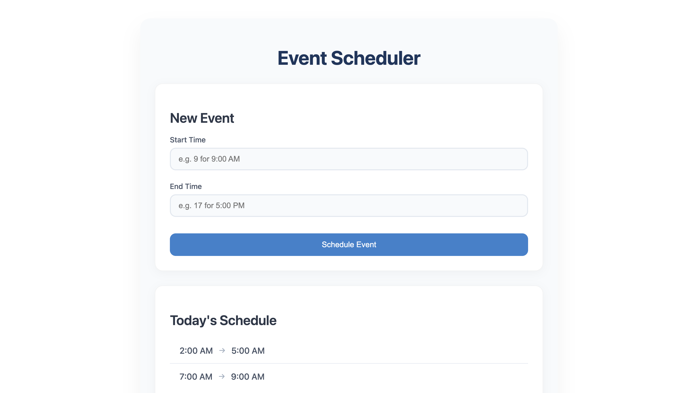

# Scheduling Application

  <!-- Update the path if the image is in a different directory -->

## Overview

This scheduling application allows users to manage events within a 24-hour day. The core functionality includes adding events while ensuring they do not overlap and displaying scheduled events in a user-friendly format.

## Approach

### 1. Understanding Requirements

Before implementation, the following core functionalities and constraints were identified:
- **Core Functionality**: Manage scheduling events within a 24-hour day without overlaps.
- **Input Representation**: Use hours (0-23) for events and format them to AM/PM for display.
- **User Interaction**: Create a straightforward UI for event creation and validation feedback.

### 2. Designing the Scheduler Class

The main class for scheduling was designed with the following features:
- **Data Structure**: Created an `Event` interface with `start_time` and `end_time` properties. 
- **Events Storage**: Used an array to hold all scheduled events.
- **Core Methods**:
  - **`addEvent()`**: Checks for overlaps before adding new events.
  - **`isEventOverlapping()`**: Validates if the new event overlaps with existing events.
  - **`formatTime()`**: Converts 24-hour time to AM/PM format for better readability.

### 3. User Interface Design

The UI was designed with user experience in mind:
- **Form Creation**: Implemented using Angular's template-driven forms for easy data binding and validation.
- **Error Handling**: Provided feedback for invalid inputs (overlapping events, incorrect time ranges).
- **Event List Display**: Created a clear list to display scheduled events for easy viewing.

### 4. Styling and Layout

- **Professional Look**: Utilized CSS for a modern, card-style layout with proper spacing and typography.
- **Responsive Design**: Ensured the application works well on different screen sizes.

### 5. Integration Without Service

- **Single Component Approach**: All logic was integrated into the `SchedulerComponent` for simplicity and ease of maintenance, reducing complexity for this small-scale application.

### 6. Testing and Validation

- **Input Validation**: Implemented validation to ensure users can only enter valid time ranges.
- **Event Overlap Checks**: Included logic to prevent overlaps, enhancing user experience.

## Conclusion

The development of this scheduling application focused on clarity, maintainability, and user experience. With a simple design, user-friendly features, and robust validation, the application serves its purpose of managing events effectively.
